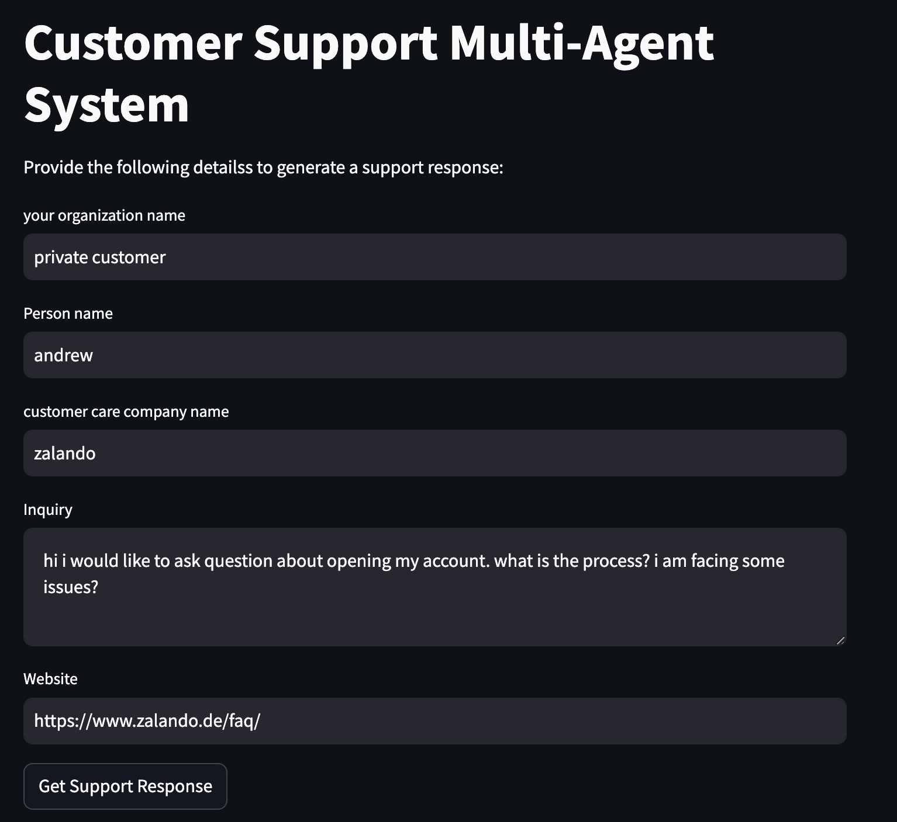
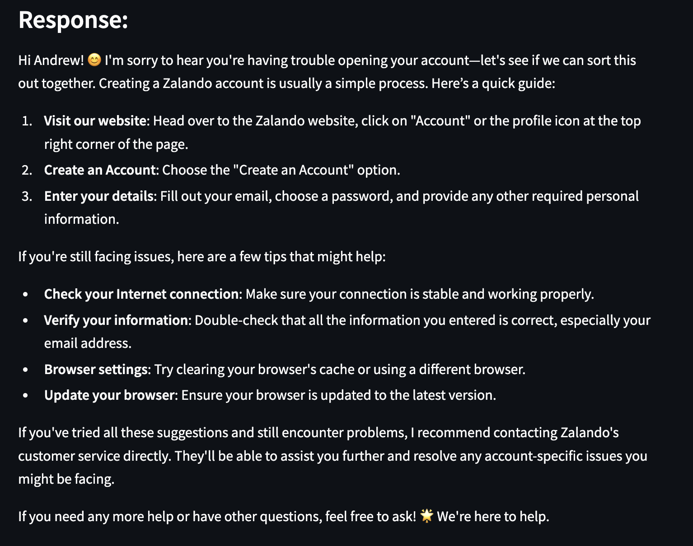

# Multi-Agent Customer Support System

This is a multi-agent customer support system built using Streamlit and the `crewai` library. The system allows users to input customer support inquiries and receive detailed responses generated by multiple agents. This application is deployed on Streamlit cloud.

## Features

- Streamlit-based user interface for easy interaction
- Multi-agent system to handle customer support inquiries for any type of business
- Dynamic task creation based on user input

 Open your web browser and go to [Customer Support](https://multiagent-customersupport.streamlit.app/) to access the application.

## Example

1. Open the application in your web browser.
2. Provide the necessary details in the input fields:
    - Organization name (yours)
    - Person name (yours)
    - Customer care company name (company name you have inquiry about)
    - Inquiry (your question)
    - Website (link to the site you need help from)
3. Click the "Get Support Response" button to generate a response.
4. The response will be displayed on the page. (you can continue asking question answer is not clear by only updating your query)

## File Structure

- [main.py](https://github.com/KiranAkram/Multiagent_CustomerSupport/blob/main/main.py): The main entry point of the application. Contains the Streamlit UI and the logic to handle user input and generate responses.
- [tasks.py](https://github.com/KiranAkram/Multiagent_CustomerSupport/blob/main/tasks.py): Contains the task definitions and functions to create dynamic tasks based on user input.
- [agents.py](https://github.com/KiranAkram/Multiagent_CustomerSupport/blob/main/agents.py): Contains the agent definitions used in the multi-agent system.
- [requirements.txt](https://github.com/KiranAkram/Multiagent_CustomerSupport/blob/main/requirements.txt): Lists the required Python packages for the application.
